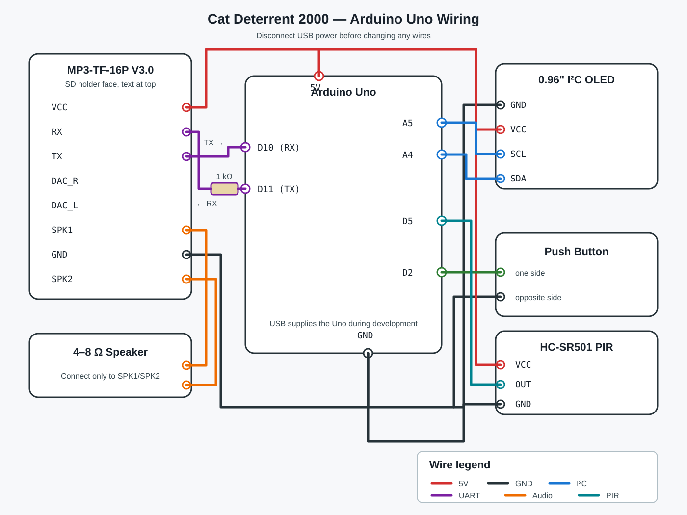

# Cat Deterrent 2000 wiring



Always disconnect USB power before moving wires.

## Connection reference

| From | To | Notes |
|---|---|---|
| OLED GND | Uno GND | Common ground |
| OLED VCC | Uno 5V | OLED accepts 3–5V |
| OLED SCL | Uno A5 | I²C clock |
| OLED SDA | Uno A4 | I²C data |
| DFPlayer VCC | Uno 5V | MP3-TF-16P V3.0 |
| DFPlayer GND | Uno GND | On this module, GND is between SPK1 and SPK2 |
| DFPlayer TX | Uno D10 | Uno SoftwareSerial receive pin |
| DFPlayer RX | Uno D11 through 1 kΩ resistor | Uno SoftwareSerial transmit pin |
| DFPlayer SPK1 | Speaker wire 1 | Do not connect either speaker wire to GND |
| DFPlayer SPK2 | Speaker wire 2 | 4–8 Ω speaker, under 3W |
| Uno D2 | One side of push button | Code uses `INPUT_PULLUP` |
| Opposite side of push button | Uno GND | No external button resistor needed |

## DFPlayer orientation

Viewed from the metal microSD-holder side, with the printed board name at the top and the card opening at the bottom, the left column is:

```text
VCC
RX
TX
DAC_R
DAC_L
SPK1
GND
SPK2
```

This order is specific to the WWZMDiB MP3-TF-16P V3.0 modules used in this project.

## MicroSD layout

```text
mp3/
├── 0001.mp3  # Hiss
├── 0002.mp3  # Get off of there
├── 0003.mp3  # Lucy get out
├── 0004.mp3  # Uh uh uh
└── 0005.mp3  # Whatcha doing
```
